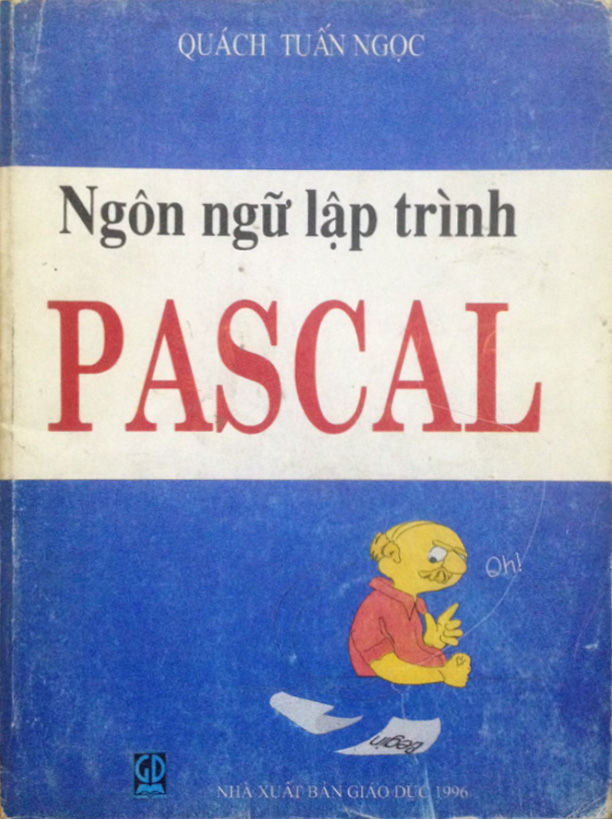

The first time I wrote an application must have been around 2011--2012. And my first programming language was Delphi, a successor of Pascal.

> It's hard to believe that it's been 10 years since.

It was an app that extracted data from astronomical events such as moon phases and star orientations, that I used for research purposes.

I remember a lot of Google searches and skimming through the book **Pascal programming language** by Quach Tuan Ngoc.

Here's an image of the cover:

My first look at Python was around 2015. Since then, it's been really helpful whenever I wanted to quickly prototype a new idea.

Such ideas could include:
- looping through all the files in a folder to classify and rename them,
- openning a data file to search for a pattern and returning results, or
- going on the internet to scrape websites.

I'd eventually written [a data pipeline](https://github.com/huydhoang/octobots) to connect databases, but that's for another day.

At the time, I had already taught myself a fair share of Delphi, a successor of Pascal, and MQL4, a C-like scripting language used to develop trading tools.

With a lot of Googling and skimming a Vietnamese book on Pascal by Quach Tuan Ngoc, I was able to make a simple looking GUI application on my Windows laptop.

But looking at Python, I had no idea what was going on. Most of the Python code that I'd seen had this pattern:
> *something = something_else.something_else*

For example,
> *data = pd.read_csv(r'path_to_a_file')*

And I couldn't understand it. What does the dot in the middle mean?

Well, 

Even though I had learned to use Delphi (a successor of Pascal) in 2011 and then MQL4 (a derivative of C, written specifically for financial trading).

### References
https://stackoverflow.com/questions/159720/what-is-the-naming-convention-in-python-for-variable-and-function-names
